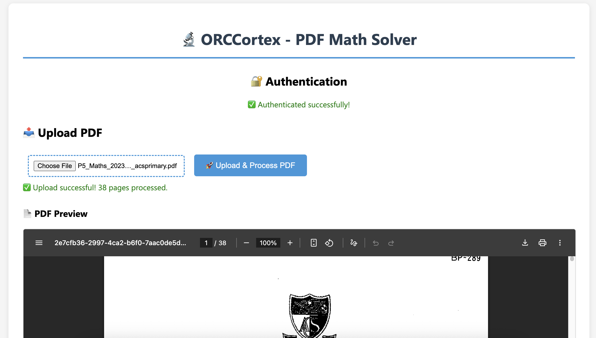

<div align="center">

</div>

# ORCCortex - OCR Math Solver

A powerful Python-based OCR math solver application with FastAPI backend and Firebase integration. This application can extract mathematical expressions from PDF documents and solve them automatically using advanced OCR and symbolic math capabilities.



## Features

- **PDF Upload & Processing**: Upload PDF files containing mathematical problems
- **OCR Text Extraction**: Extract text and mathematical expressions using multiple OCR engines
- **Math Problem Solving**: Solve mathematical expressions using SymPy
- **Firebase Integration**: Authentication and cloud storage support
- **RESTful API**: Clean REST API with comprehensive documentation
- **Background Processing**: Asynchronous processing of uploads and solutions
- **User Authentication**: Secure user management with Firebase Auth

## Architecture

```
app/
├── routers/           # API endpoints
│   ├── upload.py      # PDF upload handling
│   ├── problems.py    # Problem management
│   └── solve.py       # Math solving endpoints
├── services/          # Business logic
│   ├── firebase_service.py    # Firebase integration
│   ├── ocr_service.py         # OCR processing
│   └── math_service.py        # Math solving
├── models/            # Data models
│   ├── user.py        # User models
│   ├── problem.py     # Problem models
│   └── solution.py    # Solution models
└── utils/             # Utilities
    ├── config.py      # Configuration
    └── exceptions.py  # Custom exceptions
```

## API Endpoints

### Upload

- `POST /api/v1/upload` - Upload PDF file for processing
- `GET /api/v1/upload/status/{problem_id}` - Check processing status

### Problems

- `GET /api/v1/problems/{user_id}` - Get user's problems
- `GET /api/v1/problems/{user_id}/{problem_id}` - Get specific problem details
- `DELETE /api/v1/problems/{user_id}/{problem_id}` - Delete a problem

### Solve

- `POST /api/v1/solve/{problem_id}` - Solve math problems from a PDF
- `POST /api/v1/solve/expression` - Solve a single math expression
- `GET /api/v1/solve/{problem_id}/solutions` - Get problem solutions
- `GET /api/v1/solve/solution/{solution_id}` - Get solution details

## Installation

1. **Clone the repository**:

   ```bash
   git clone https://github.com/ORCCortex/ORCCortex.git
   cd ORCCortex
   ```

2. **Install dependencies**:

   ```bash
   pip install -r requirements.txt
   ```

3. **Install system dependencies**:

   For Ubuntu/Debian:

   ```bash
   sudo apt-get update
   sudo apt-get install tesseract-ocr
   sudo apt-get install poppler-utils
   ```

   For macOS:

   ```bash
   brew install tesseract
   brew install poppler
   ```

4. **Configure environment variables** (create `.env` file):

   ```bash
   # Firebase Configuration
   FIREBASE_CREDENTIALS_PATH=path/to/your/firebase-credentials.json
   FIREBASE_STORAGE_BUCKET=your-bucket-name.appspot.com

   # Application Configuration
   DEBUG=True
   MAX_FILE_SIZE=10485760
   UPLOAD_DIR=uploads

   # OCR Configuration (optional)
   TESSERACT_CMD=/usr/bin/tesseract
   ```

5. **Run the application**:

   ```bash
   python main.py
   ```

   Or using uvicorn directly:

   ```bash
   uvicorn main:app --host 0.0.0.0 --port 8000 --reload
   ```

## Usage

### 1. Access the API Documentation

- Swagger UI: `http://localhost:8000/docs`
- ReDoc: `http://localhost:8000/redoc`

### 2. Upload a PDF

```bash
curl -X POST "http://localhost:8000/api/v1/upload" \
  -H "Authorization: Bearer YOUR_FIREBASE_TOKEN" \
  -F "file=@math_problems.pdf"
```

### 3. Get User Problems

```bash
curl -X GET "http://localhost:8000/api/v1/problems/user123" \
  -H "Authorization: Bearer YOUR_FIREBASE_TOKEN"
```

### 4. Solve Problems

```bash
curl -X POST "http://localhost:8000/api/v1/solve/problem123" \
  -H "Authorization: Bearer YOUR_FIREBASE_TOKEN"
```

### 5. Solve Expression Directly

```bash
curl -X POST "http://localhost:8000/api/v1/solve/expression" \
  -H "Authorization: Bearer YOUR_FIREBASE_TOKEN" \
  -H "Content-Type: application/json" \
  -d '{"expression": "2x + 5 = 15"}'
```

## Dependencies

### Core Framework

- **FastAPI**: Modern Python web framework
- **uvicorn**: ASGI server implementation

### Firebase Integration

- **firebase-admin**: Firebase Admin SDK

### PDF Processing

- **pdfminer.six**: PDF text extraction
- **PyMuPDF**: Advanced PDF processing

### OCR

- **pytesseract**: Python wrapper for Tesseract OCR

### Math Solving

- **sympy**: Symbolic mathematics library

### Additional

- **python-multipart**: File upload support
- **pydantic**: Data validation
- **python-dotenv**: Environment variables

## Configuration

### Environment Variables

| Variable                    | Description                       | Default     |
| --------------------------- | --------------------------------- | ----------- |
| `FIREBASE_CREDENTIALS_PATH` | Path to Firebase credentials JSON | ""          |
| `FIREBASE_STORAGE_BUCKET`   | Firebase Storage bucket name      | ""          |
| `DEBUG`                     | Enable debug mode                 | False       |
| `MAX_FILE_SIZE`             | Maximum upload file size in bytes | 10485760    |
| `UPLOAD_DIR`                | Local upload directory            | "uploads"   |
| `TESSERACT_CMD`             | Tesseract executable path         | "tesseract" |

### Firebase Setup

1. Create a Firebase project at https://console.firebase.google.com/
2. Enable Authentication and Storage
3. Download the service account credentials JSON file
4. Set the `FIREBASE_CREDENTIALS_PATH` environment variable

## Development

### Project Structure

The application follows a modular structure:

- **Routers**: Handle HTTP requests and responses
- **Services**: Contain business logic and external integrations
- **Models**: Define data structures using Pydantic
- **Utils**: Provide configuration and utility functions

### Adding New Features

1. Define models in `app/models/`
2. Implement business logic in `app/services/`
3. Create API endpoints in `app/routers/`
4. Update main.py to include new routers

### Testing

Run the application and test endpoints using:

- Built-in Swagger UI at `/docs`
- External tools like Postman or curl
- Unit tests (to be implemented)

## Error Handling

The application includes comprehensive error handling:

- Custom exception classes for different error types
- HTTP status codes following REST conventions
- Detailed error messages for debugging

## Security

- Firebase Authentication for user management
- Token-based API authentication
- File type validation for uploads
- File size limits to prevent abuse

## Contributing

1. Fork the repository
2. Create a feature branch
3. Make your changes
4. Test your changes
5. Submit a pull request

## License

This project is open source and available under the MIT License.

## Support

For issues and questions:

- Check the documentation at `/docs`
- Review the code structure
- Open an issue on GitHub

---

**ORCCortex** - Transforming mathematical problem-solving through OCR and AI
